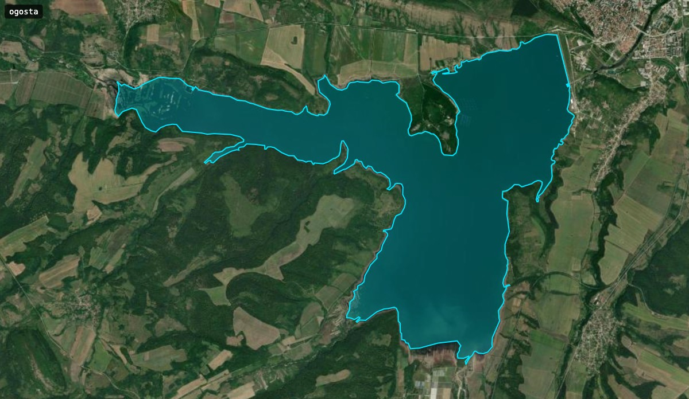

# Bulgaria state reservoirs: polygon geometry

GeoJSON polygons for the **52 state-managed reservoirs of Bulgaria**, one file per reservoir under [`data/`](./data). Geometry is extracted from [OpenStreetMap](https://www.openstreetmap.org) and published under the [Open Database License v1.0 (ODbL)](https://opendatacommons.org/licenses/odbl/1-0/).

## Quick start

Each polygon traces the reservoir's shoreline. For example, Ogosta, Bulgaria's second largest reservoir by capacity, has a multi-armed outline:



Drag any file from [`data/`](./data) into [geojson.io](https://geojson.io) to view the polygon on a basemap. The files are plain GeoJSON, readable by MapLibre, Mapbox GL, Leaflet, QGIS, `JSON.parse`, or any other tool that reads GeoJSON.

## Data format

One `data/<slug>.geojson` file per reservoir. Each is a single GeoJSON `Feature` with `Polygon` geometry. The `<slug>` is a stable kebab-case identifier matching the filename (e.g. `iskar`, `golyam-beglik`).

- **Coordinates** are `[longitude, latitude]` in WGS84, at 7 decimal places (~1 cm precision).
- **Geometry is always `Polygon`**, never `MultiPolygon`. Where OSM maps a reservoir as several disconnected outer rings, only the largest is kept.
- **Inner rings are preserved** and represent islands inside the reservoir (13 of the 52 files have them).
- **Properties are intentionally empty** (`{}`). This dataset is geometry only. Names, basin codes, capacities, and daily volumes are not included here; join on the filename slug if you need to attach them from another source.

## Validation

Every file is checked against [RFC 7946](https://www.rfc-editor.org/rfc/rfc7946) on each push and pull request. Run the same check locally (requires [Bun](https://bun.sh)):

```bash
./scripts/validate.sh
```

Conformance errors fail the run. The right-hand-rule winding recommendation is a non-fatal advisory; the polygons render correctly regardless of ring direction.

## Provenance & known quirks

The dataset was assembled by matching the canonical list of 52 state-managed reservoirs from Bulgaria's Ministry of Environment and Water (MoEW; Bulgarian: Министерство на околната среда и водите, МОСВ) against OpenStreetMap. A few quirks in the underlying OSM data shaped how the dataset was built:

- **Inconsistent tagging:** reservoirs don't live under one OSM tag. Querying only the canonical `water=reservoir` found roughly 80% of them; reaching all 52 meant querying four tag families: `water=reservoir`, `water=basin`, `landuse=reservoir`, and `natural=water` features named `яз.`/`язовир` (the last for major reservoirs that lack a `water=*` tag). Chaira (Чаира) is tagged `water=lake` despite being an artificial pumped-storage reservoir.
- **Inconsistent name casing:** OSM contributors write both `яз.` and `Яз.` (e.g. `Яз.Чаира`), so name matching must be case-insensitive; a case-sensitive query silently drops them.
- **Pasarel vs Kokalyane:** MoEW calls one upper-Iskar reservoir Kokalyane (Кокаляне, after the gorge); OSM names the same polygon Pasarel (Пасарел, after the village). This repo uses the MoEW name (`kokalyane.geojson`); the source OSM polygon (`way/277322334`) is `яз. Пасарел`.
- **Mixed feature types:** matches are a mix of OSM `way` and `relation` objects. Relations were stitched into single polygons by joining member ways tip-to-tip.
- **Auxiliary basins collapsed:** where OSM maps a reservoir as a main basin plus smaller secondary ponds, only the largest polygon is kept (notably Golyam Beglik (Голям Беглик)). Consumers needing the auxiliary basins should query OSM directly.

## Attribution & licence

The data is available under the [Open Database License v1.0 (ODbL)](https://opendatacommons.org/licenses/odbl/1-0/); see [LICENSE](./LICENSE).

If you use these files, credit OpenStreetMap:

> © OpenStreetMap contributors

Link to <https://www.openstreetmap.org/copyright> wherever practical (footer, "About" page, or map attribution control). If you redistribute the data or a modification of it, ODbL also requires you to preserve this licence and release any derived database under ODbL. Rendered maps are "produced works" under ODbL: attribution is required, but share-alike does not extend to your map code or styling.

## Sources

- **Geometry:** [OpenStreetMap](https://www.openstreetmap.org), licensed under [ODbL 1.0](https://opendatacommons.org/licenses/odbl/1-0/).
